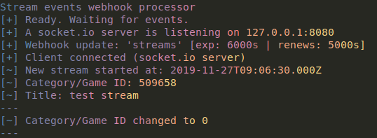

# Twitch Stream Events Pipeline

A small webhook pipeline for title, category and online status changes. These are passed to a socket.io instance for other applications to consume through callbacks.



# Important (temporary workaround)

A Bearer token is required. [This pull](https://github.com/true-dubach/node-twitch-webhook/pull/15), 
or `twitch-webhook-modified-index.js` can be swapped with twitch-webhook's `index.js` in `node_modules` to allow token use.

After running `npm i`, `index.js` will need to be updated/copied in again.

# Libraries

* `twitch-webhook` (modified)

* `socket.io`

* `gradient-string`

# Installation

1. Have `nodejs` installed and clone this repository

2. `npm i`

3. Copy `settings.json.example` to `settings.json`

4. Edit settings.json and replace values with ones suitable for production use

# Production notes

### Webhook delivery time

Webhook callbacks from Twitch (for events) can be delayed for approximately 2+ minutes from when an event change happens at certain times (measurements - min: ~15s, avg: 1m, max: 2m30s).

### Configuration (settings.json)

* `LeaseSeconds` the number of seconds before a webhook will expire on Twitch's end (864000 seconds maximum / 10 days)

* `LeaseRenewalInterval` the number of seconds to wait before renewing the webhook (one-shot, no retries currently)

* `SocketPort` socket.io port

* `SocketAddr` listening address

* `Callback` should point to the URL where this application is accessible (through a reverse proxy or directly)

* `BroadcasterId` is the user ID (numeric) of the broadcaster to look for changes from

### Acquiring a bearer token

Instructions are embedded in the header of `index.js`

### Reverse proxy (SSL)

The internal node server can do https to receive callbacks, but this might be better served by a dedicated server like Caddy, which can provide a free SSL certificate + handle renewals through Lets Encrypt.

Caddy's configuration:

```
webhook.target.example.com {
  proxy / 127.0.0.1:8443
}
```

settings.json:
```
ListenPort: 8443,
ListenHost: 127.0.0.1,
ListenAutoStart: true
```

# Socket.io client

A sample socket.io client is in `client.js` that shows how another nodejs application might listen for
(and act on) events returned by this application/twitch's webhooks.

# Running

```
node index.js
```

Logs will print to the console and if your settings are OK, this utility will register
webhooks and wait for them to come in. On an event, both the console and a connected `socket.io`
client will be notified the event change.
